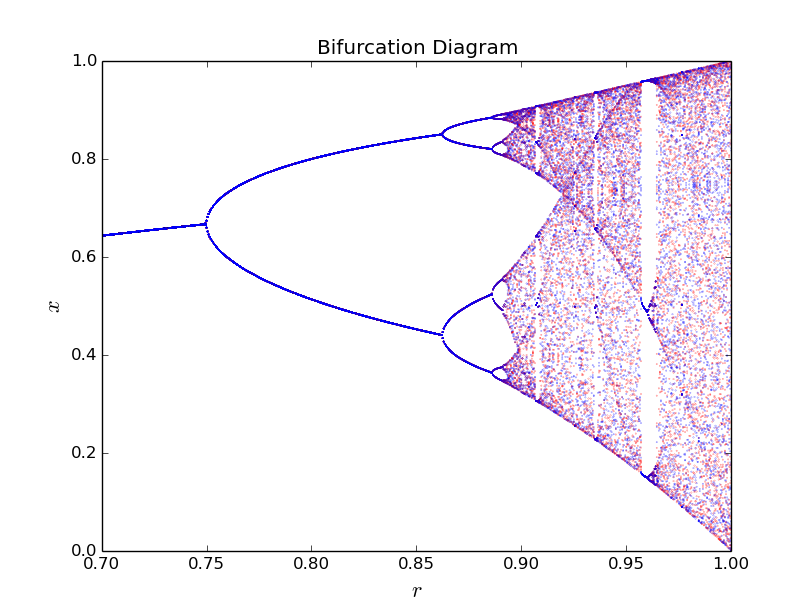

.. _6-2-label:

===============================================================================
問題6.2 - ロジスティック写像の定性的な特徴
===============================================================================

.. contents::

シミュレーションの目的
============================

ロジスティック写像

.. math:: x_{n+1}=f(x_{n})=4rx_{n}(1-x_{n})
    :label: logistic

の振る舞いを調べる方法の一つとして、\ :math:`x`\ の値を\ :math:`r`\ の関数としてプロットする方法がある。初期の過渡的な振る舞いを捨てて、その後の反復で得られる\ :math:`x`\ の値をプロットするのである。本シミュレーションの目的は、式\ :eq:`logistic`\ を差分方程式として扱い、上に述べたような条件を満たすようなプログラムを作成して、実際にシミュレーションを行うことである。

作成したプログラム
=============================
Pythonを用いて作成したプログラムを以下に示す。

* パラメータの設定ダイアログ( :download:`SetParameter.py <SetParameter.py>` )

.. literalinclude:: SetParameter.py
    :language: python
    :linenos:
    
* ロジスティック写像の計算を行うプログラム( :download:`myplot_bifurcation.py <myplot_bifurcation.py>` )

.. literalinclude:: myplot_bifurcation.py
    :language: python
    :linenos:

* 実行プログラム( :download:`6-2_bifurcate.py <6-2_bifurcate.py>` )

このプログラムは、追加のモジュールとして、matplotlibを使用している。プログラムを実行すると各パラメータ{x0, ntransient, nplot, r0, dr}(x0:xの初期値\ :math:`x_{0}`\ , ntransient:プロットしないnの範囲, nplot:プロットするnの大きさ, r0:制御パラメータ\ :math:`r`\ の初期値, dr:プロットする\ :math:`r`\ の刻み幅)の設定ダイアログが開き、値を設定してOKボタンを押すことで、その値で計算されたロジスティック写像の分岐図が描画される。はじめのntransient回は、計算はするがプロットはされず、次のnplot回は赤でプロットし、その後のnplot回は青でプロットする。

.. literalinclude:: 6-2_bifurcate.py
    :language: python
    :linenos:

実習課題
=====================

a. 作成したプログラムを使って、教科書の図6.2の再現を行う。
 
* 初期値として、\ :ref:`表1 <tab-6-2-t1>`\ に示した値を代入してプログラムを実行した結果を\ :num:`図#fig-6-2-f1`\ に示す。このグラフから、\ :math:`r=0.75`\ で周期が2になり、\ :math:`r=0.86`\ のあたりで周期が4となり、また\ :math:`r=0.89`\ のあたりで周期が8となっていく様子を見ることができる。また、それ以降は判別が難しくなり、カオス的な振る舞いとなった。しかし、ところどころには周期的振る舞いを示す領域も存在していることも見て取れる。

.. _tab-6-2-t1:
    
.. csv-table:: 表1. 使用した各種パラメータの値
    :header: パラメータ, 値
    :widths: 10, 6

    x0, 0.3
    ntransient, 1000
    nplot, 50
    r0, 0.7
    dr, 0.0005

.. _fig-6-2-f1:

    
    \ :ref:`表1 <tab-6-2-t1>`\ で定めたパラメータでのBifurcation-Diaglam
    

まとめ
=======================

ロジスティック写像の定性的な特徴を、Bifurcation-Diaglamを作成することにより確認することができた。

参考文献
============================

* ハーベイ・ゴールド,ジャン・トボチニク,石川正勝・宮島佐介訳『計算物理学入門』,ピアソン・エデュケーション, 2000.

